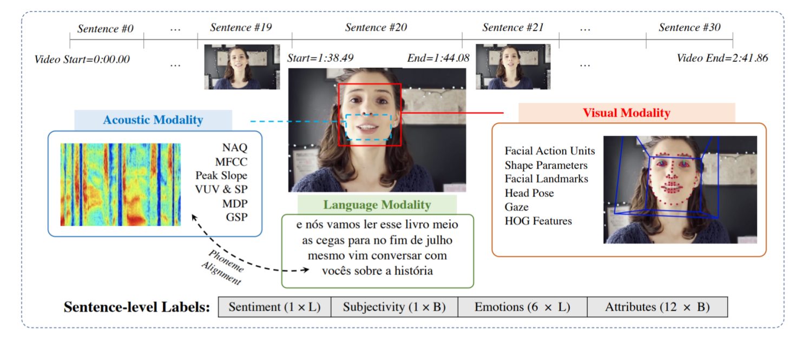
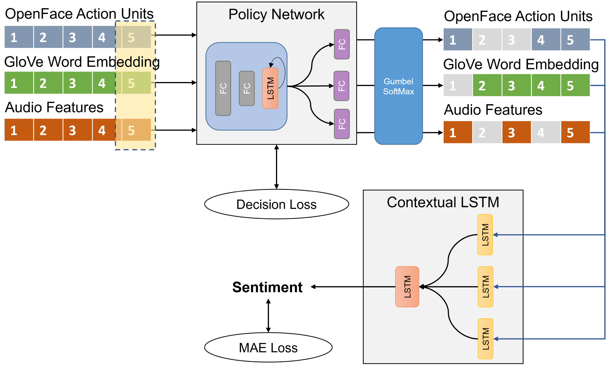
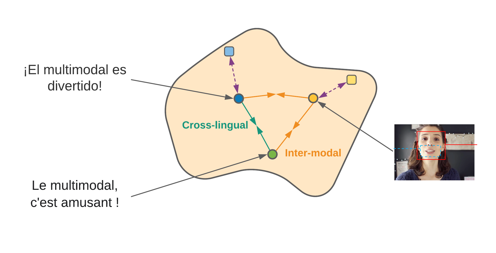

# 11777-Project: Multimodal Multilingual Sentiment Analysis

## Abstract

Multimodal sentiment analysis, which is the idea of using language, acoustic, and visual features to detect sentiment, is a well-established research question. However, very few work has been done on languages other than English, partly because there was no cross-linguistic sentiment analysis dataset available in the past, and because low-resource languages are so many and diverse that we cannot build models on every of them.

With the release of CMU-MOSEAS dataset [[1]](#1), which contains sentiment labels for video clips in four European languages, we propose to build a multilingual multimodal sentiment detection model by transfer learning. Specifically, we generate cross-linguistic paired texts by means of translation and adopt Noise Contrastive Estimation (NCE) as the learning objective. We also explore Adaptive MML that filters out non-representative modalities in the flow for efficient and robust sentiment analysis.

## Dataset

We primarily work with the CMU Multimodal Opinion Sentiment, Emotions and Attributions dataset (CMU-MOSEAS) [[1]](#1). It provides recordings of synchronous visual, audio and transcript information in four different European languages (French, Spanish, Portuguese and German).

## Approach 1: Few-Shot Transfer Learning: AdaMML [[2]](#2) with Contextual LSTM [[3]](#3)
Our goal is to use a much smaller subset of Spanish training data together with full French training data to reach similar level of model accuracy as compared to learning from the full Spanish training set. We also employ an adaptive policy to select relevant modalities for prediction.

## Approach 2: Noise Contrastive Estimation Objective with Translation Augmentation

Inspired by the work in Huang et al., 2021 [[4]](#4), we aim to learn a coordinated, multilingual multimodal embedding space that facilitates the downstream sentiment analysis task. We employ two NCE objectives, cross-lingual and inter-modal loss. The cross-lingual loss is based on the intuition that conditioned on a video, multilingual transcripts (translated pairs in our case) should be semantically similar. The inter-modal loss enforces the similarity of paired video and transcript.

We use Multilogue-Net [[5](#5)] as our testbed and experiment with different contrastive objectives.

For more details about baseline models, approaches and results, please refer to our report [here](./report.pdf).

## References
<a id="1">[1]</a> 
A. Bagher Zadeh, Y. Cao, S. Hessner, P. P. Liang,S. Poria, and L.-P. Morency, *CMU-MOSEAS: A multimodal language dataset for Spanish, Portuguese, German and French*, in Proceedings of the 2020 Conference on Empirical Methods inNatural Language Processing (EMNLP), Online, Nov. 2020, Association for Computational Linguistics, pp. 1801–1812.

<a id="2">[2]</a>
R. Panda, C.-F. Chen, Q. Fan, X. Sun, K. Saenko,A. Oliva, and R. Feris, *AdaMML: Adaptive Multi-Modal Learning for Efficient Video Recognition*, in International Conference on Computer Vision (ICCV), 2021.

<a id="3">[3]</a>
S. Poria, E. Cambria, D. Hazarika, N. Majumder,A. Zadeh, and L.-P. Morency, *Context-dependent sentiment analysis inuser-generated videos*, in Proceedings of the 55th Annual Meeting of the Association for ComputationalLinguistics (Volume 1: Long Papers), Vancouver, Canada, July 2017, Association for ComputationalLinguistics, pp. 873–883.

<a id="4">[4]</a>
P. Huang, M. Patrick, J. Hu, G. Neubig, F. Metze, and A. G. Hauptmann, *Multilingual multimodal pre-training for zero-shot cross-lingual transfer of vision-language models*, CoRR, abs/2103.08849 (2021).

<a id="5>[5]</a>
Shenoy, A. and Sardana, A. *Multilogue-net: Acontext-aware RNN  for  multi-modal emotion  detection and sentiment analysis in conversation*. In Second Grand-Challenge and Workshop  on   Multi-modal  Language (Challenge-HML), pp. 19–28, Seat-tle, USA, July  2020. Association for  Computational Linguistics. 

